# ARSW - Laboratorio 10

## Laboratorio – Escalamiento en Azure con Maquinas Virtuales, Sacale Sets y Service Plans

## Integrantes:

- Crhystian Molano
- Juan Caceres

### Descripción
Adjunto a este laboratorio usted podrá encontrar una aplicación totalmente desarrollada que tiene como objetivo calcular el enésimo valor de la secuencia de Fibonnaci.
Escalabilidad Cuando un conjunto de usuarios consulta un enésimo número (superior a 1000000) de la secuencia de Fibonacci de forma concurrente y el sistema se encuentra bajo condiciones normales de operación, todas las peticiones deben ser respondidas y el consumo de CPU del sistema no puede superar el 70%.

### *PARTE I: Escalabilidad vertical*

Se crea la maquina virtual.

Se realiza la conexión ssh y se instala dependencias.

Se clona el repositorio y se instala Postman.

Se agrega reglas de seguridad de entrada.

Se realiza prueba en navegador.

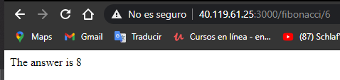

### Preguntas

1. ¿Cuántos y cuáles recursos crea Azure junto con la VM?
2. ¿Brevemente describa para qué sirve cada recurso?

Se crean 8 recursos, los cuales son:

	- Maquina virtual
	Recurso usado para alojar la aplicacion sin tener equipo fisico.

	- Clave SSH
	Recurso para realizar la conexion a la maquina virtual por medio de la llave.

	- Network Watcher
	Recurso que monitorea y repara el estado de la red. 

	- Red virtual
	Recurso que administra la red 

	- Direccion IP publica
	Recurso que administra la ip publica de la maquina virtual
	
	- Grupo de seguridad
	Recurso que mantiene y gestiona la seguridad de la maquina virtual, que permiten o niegan el trafico	

	- Interfaz de red
	Recurso que permite que una maquina se conecte con internet y recursos locales.

	- Disco
	Recurso que permite tener el almacenamiento de la maquina virtual

3. ¿Al cerrar la conexión ssh con la VM, por qué se cae la aplicación que ejecutamos con el comando npm FibonacciApp.js? ¿Por qué debemos crear un Inbound port rule antes de acceder al servicio?

Al cerra la conexion ssh terminamos la ejecucion del proceso "FibonacciApp.js" por eso se cae.

Se debe crear un Inbound port rule para permitir el acceso al servicio publico.

4. Adjunte tabla de tiempos e interprete por qué la función tarda tando tiempo.

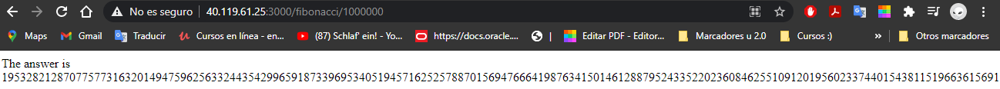
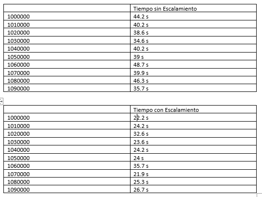

5. Adjunte imágen del consumo de CPU de la VM e interprete por qué la función consume esa cantidad de CPU.

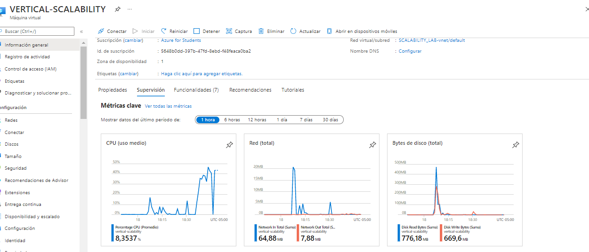

Antes del escalamiento vertical el consumo de la cpu llego a casi el 95% y despues del escalamiento el consumo de cpu llega casi al 50%.

6. Adjunte la imagen del resumen de la ejecución de Postman. Interprete:

    - Se realiza la configuracion y se coloca la ip

   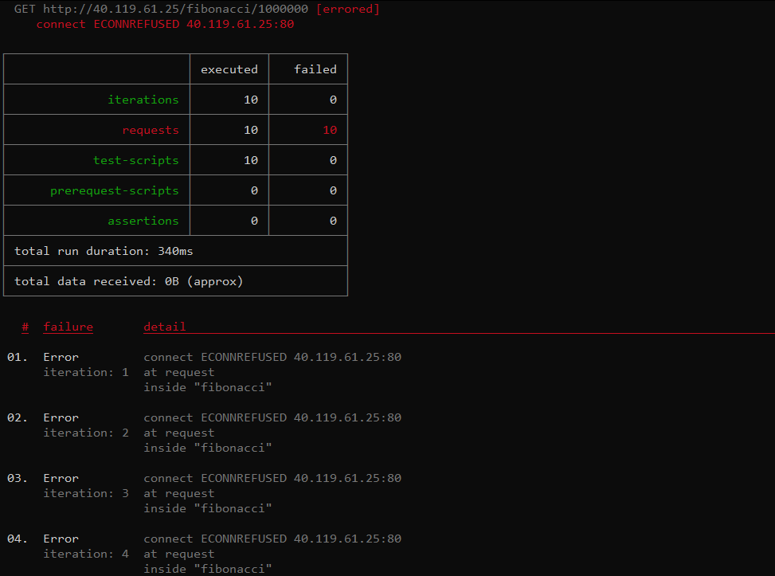

   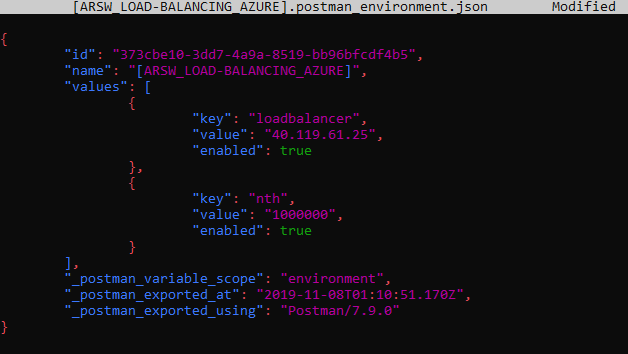

    - Se realiza el analisis de forma correcta

   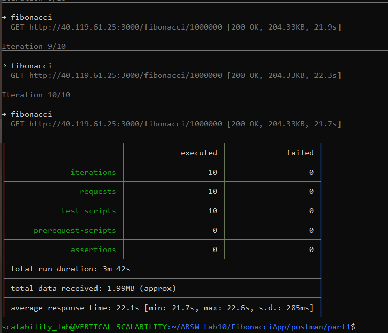

   Tiempos de ejecución de cada petición.

   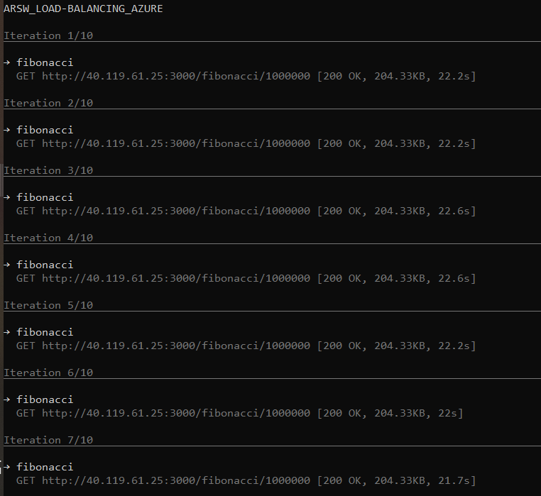

   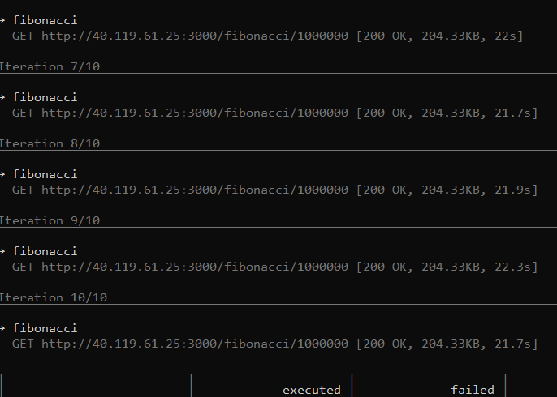

   Si hubo fallos documentelos y explique.

    - antes de realizar las peticiones fallaba ya que la ip era diferente a la del recurso asignado.

7. ¿Cuál es la diferencia entre los tamaños B2ms y B1ls (no solo busque especificaciones de infraestructura)?

cambio de tamaño.
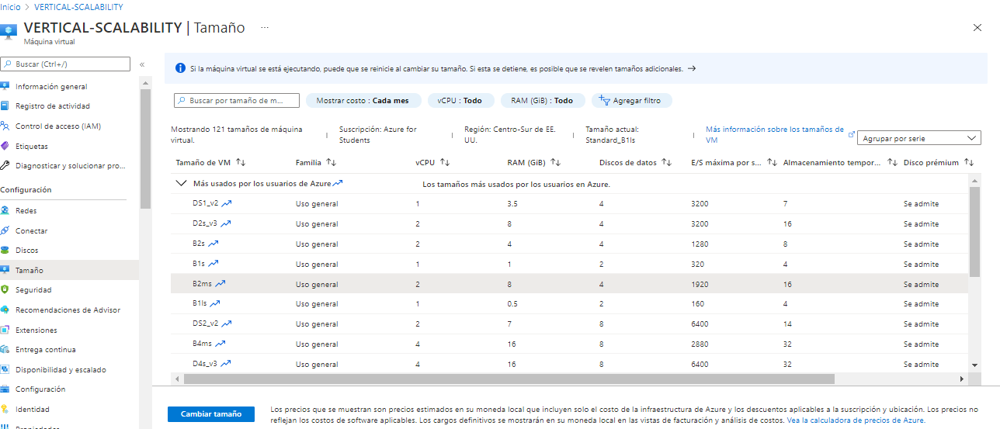

	- B1ls tiene memoria mas pequeña pero su costo es el mas bajo y el B2ms tiene una memoria mucho mas amplia de 8 GiB y mayor cpu por ende mejor rendimienton pero su costo es mayor al anterior.

8. ¿Aumentar el tamaño de la VM es una buena solución en este escenario?, ¿Qué pasa con la FibonacciApp cuando cambiamos el tamaño de la VM?
    - Seria buena solucion al mejorar la capacidad de procesamiento mejoran la carga de la cpu y sus tiempos.

9. ¿Qué pasa con la infraestructura cuando cambia el tamaño de la VM? ¿Qué efectos negativos implica?
    - El costo de esta implementacion es muy alto para mantener.

10. ¿Hubo mejora en el consumo de CPU o en los tiempos de respuesta? Si/No ¿Por qué?
    - Tiene mejoras en el consumo de cpu ya que cuenta con mayot capacidad de procesamiento.

11. Aumente la cantidad de ejecuciones paralelas del comando de postman a 4. ¿El comportamiento del sistema es porcentualmente mejor?
    - El porcentaje del comportamiento es mejor ya que presenta menos fallos.

### *PARTE II: Escalabilidad horizontal*

Iniciamos creando el equilibrador de carga con la siguiente configuracion.

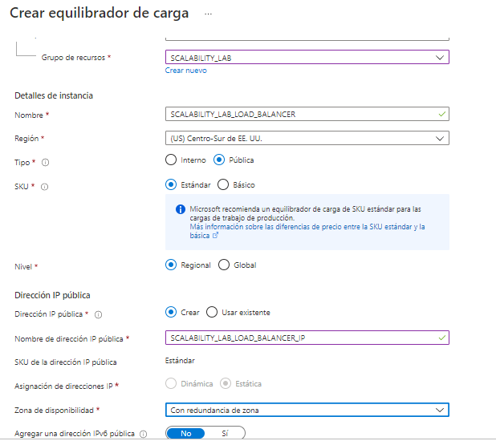

Se crea un BackendPool y su sondeo de estado con la siguiente configuracion.

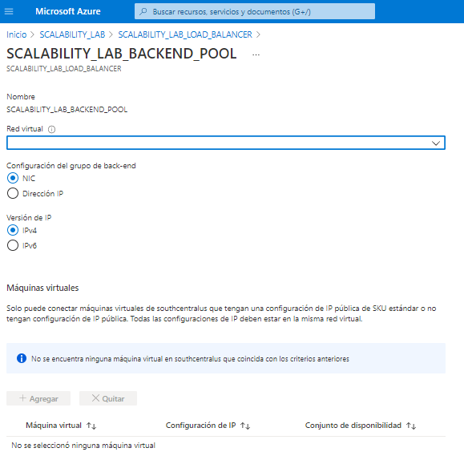

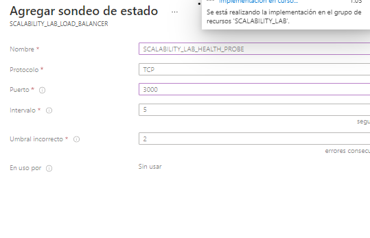

Se agrega la regla de equilibrio de carga y se crea una red virtual.

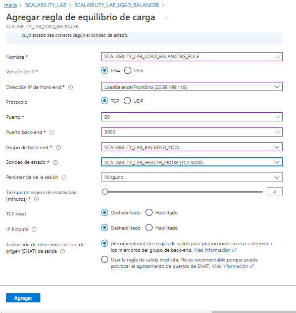

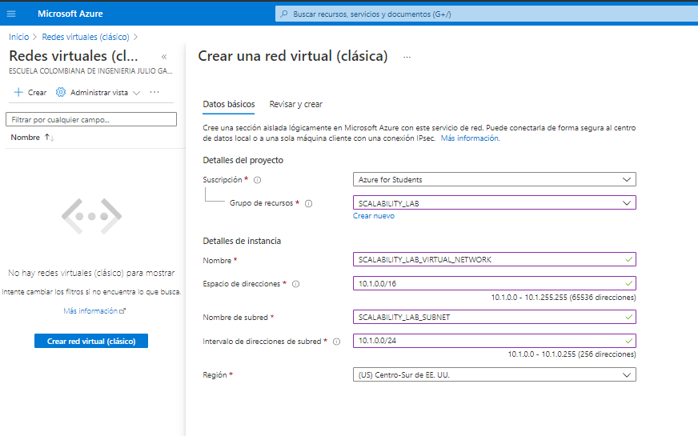

Iniciamos la creacion de las 3 maquinas virtuales con su configuracion basica y de red.

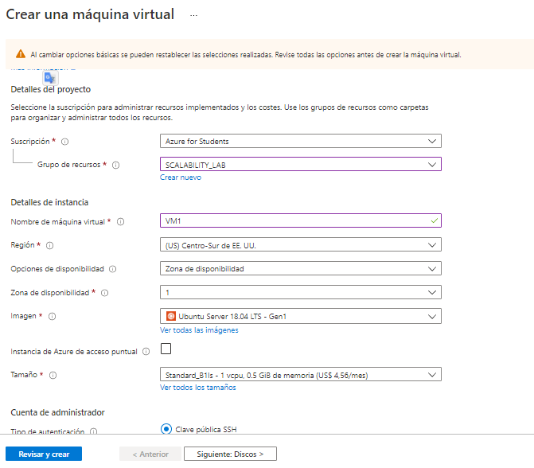

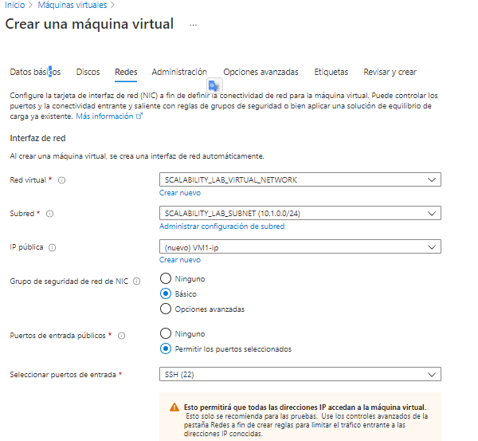

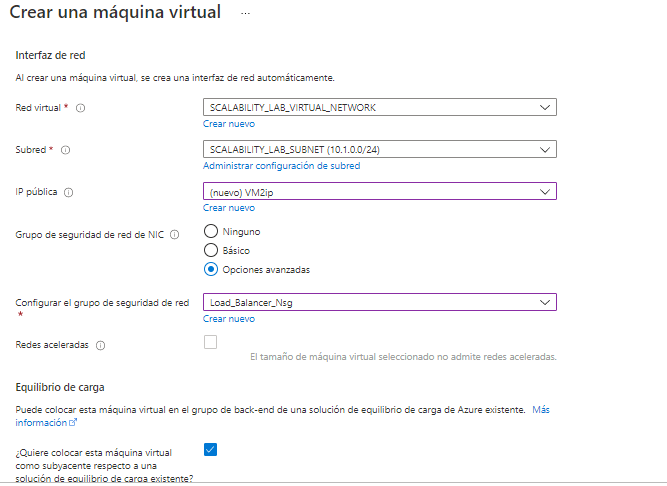

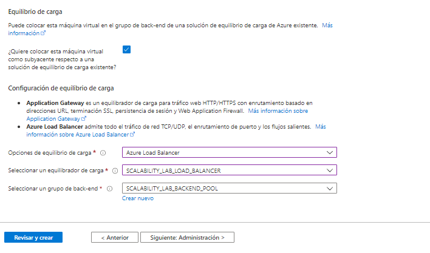

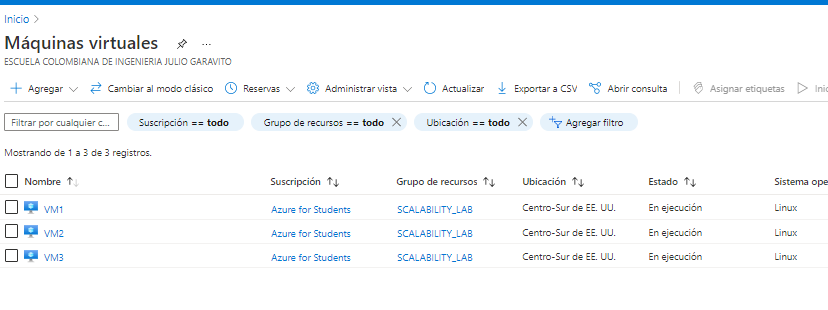

Se realiza la conexion con las maquinas virtuales y se procede a hacer instalacion de los complementos usados

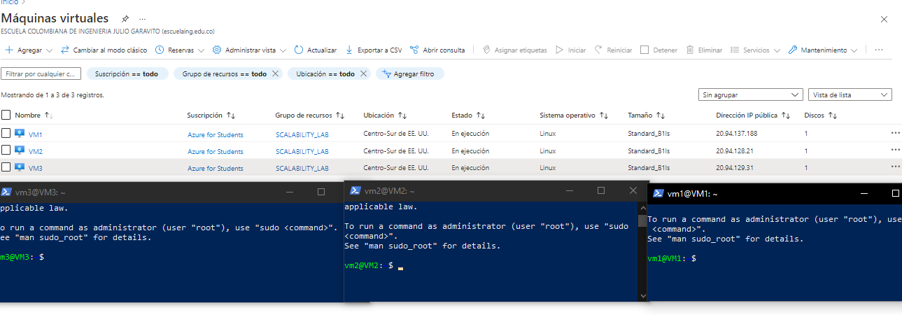

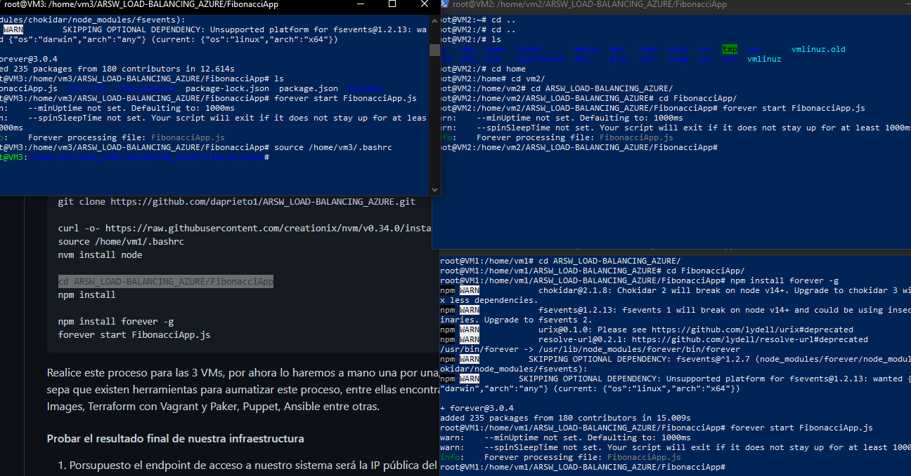

se realiza la prueba en el navegador.

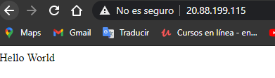

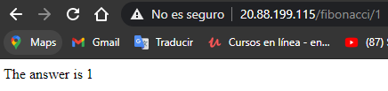

### Preguntas

1. ¿Cuáles son los tipos de balanceadores de carga en Azure y en qué se diferencian?, ¿Qué es SKU, qué tipos hay y en qué se diferencian?, ¿Por qué el balanceador de carga necesita una IP pública?

existen dos tipos de load balancer:

- uno es de tipo publico el cual proporciona conexiones a las maquinas salientes en donde su direccion IP privadas se trasforman a IP publicas, es mas usado para balancear la carga del trafico en internet.
- el segundo es de tipo interno o privado el cual necesita direcciones IP privadas solo en la interfaz, es frecuentemente usado en el trafico de una red virtual.

*SKU*

Azure Container Registry es una unidad de mantenimiento de existencias, son un codigo unico asignado a un servicio o producto dentro de azure y representan la posibilidad de comprar existencias.
Estos niveles proporcionan precios predecibles y varias opciones para alinearse con la capacidad y los patrones de uso de su registro.

existen tres tipos de SKU:

- Basico: Un punto de entrada con costos optimizados para que los desarrolladores aprendan sobre Azure Container Registry.
- Estandar: Los registros estándar ofrecen las mismas capacidades que los básicos, con un mayor rendimiento de imágenes y almacenamiento incluido.
- Premium: Los registros Premium proporcionan la mayor cantidad de almacenamiento incluido y operaciones simultáneas, lo que permite escenarios de gran volumen.

IP pública en los load balancer: es necesario asociar una direccion IP publica con una instancia de load balancer para que sea accesible desde internet.

2. ¿Cuál es el propósito del Backend Pool?

El proposito de Backend Pool es brindar trafico para una regla de load balancer determinada.

3. ¿Cuál es el propósito del Health Probe?

El proposito de Health Probe es determinar si la instancia esta en buen estado. si la instancia falla dejara de recibir trafico hasta que vuelva a pasar las pruebas de nuevo.

4. ¿Cuál es el propósito de la Load Balancing Rule? ¿Qué tipos de sesión persistente existen, por qué esto es importante y cómo puede afectar la escalabilidad del sistema?.

Las reglas que se definen para el agente de escucha determinan cómo el balanceador de carga va a direccionar las solicitudes a los destinos de uno o varios grupos de destino.

Cuando el cliente inicia una nueva sesión desde la misma IP de origen, el puerto de origen cambia y provoca que el tráfico vaya hacia otro punto de conexión del centro de datos.

5. ¿Qué es una Virtual Network? ¿Qué es una Subnet? ¿Para qué sirven los address space y address range?

Azure Virtual Network es el bloque de construcción fundamental para su red privada en Azure. permite que muchos tipos de recursos de Azure se comuniquen de forma segura entre sí, con Internet y con las redes locales.

las Subnet permiten segmentar la red virtual en una o más subredes y asignar una parte del espacio de direcciones de la red virtual a cada subred.

Al crear una red virtual, se debe especificar un espacio de direcciones IP privado personalizado utilizando direcciones públicas y privadas.

6. ¿Qué son las Availability Zone y por qué seleccionamos 3 diferentes zonas?. ¿Qué significa que una IP sea zone-redundant?

Las zonas de disponibilidad son ubicaciones aisladas de errores en una región de Azure que proporcionan alimentación, refrigeración y funcionalidad de red redundantes.

Seleccionamos 3 zonas de disponibilidad diferentes para tener la capacidad de aislar las máquinas virtuales dentro de tres centros de datos diferentes para obtener alta disponibilidad.

7. ¿Cuál es el propósito del Network Security Group?

Un Network Security Group consta de un conjunto de reglas de control de acceso que describen los filtros de tráfico. Estos pueden asociarse con una máquina virtual o una subred en la misma región.

8. Informe de newman 1 (Punto 2)

Pruebas con cada maquina.

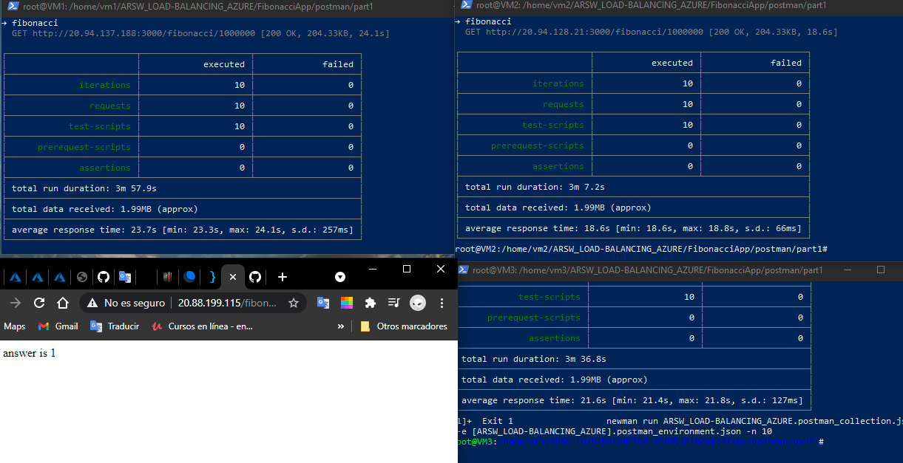

pruebas con la maquina numero 4.

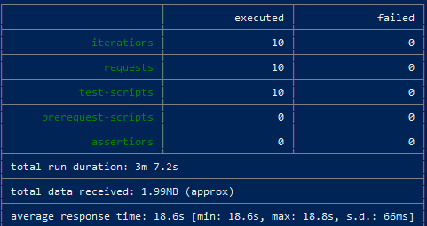

uso de cpu en:

vm1.

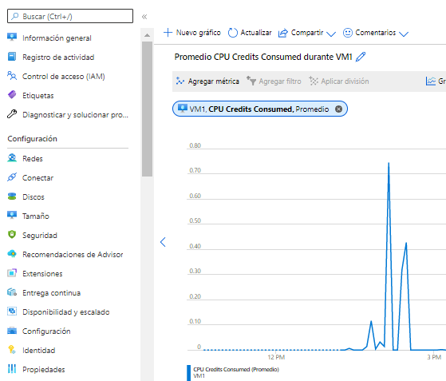

vm2.

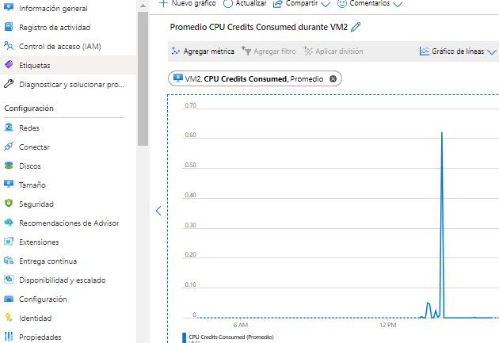

vm3.

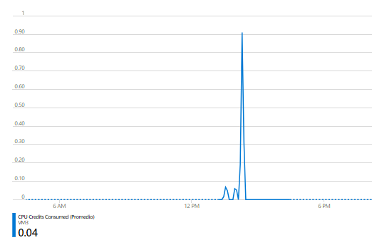

vm4 observamos aqui la reducion del trafico.

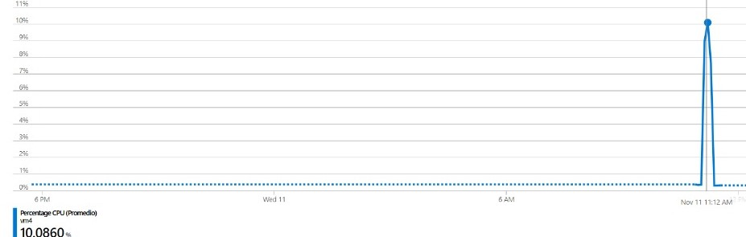

9. Presente el Diagrama de Despliegue de la solución.

Diagrama de despliegue.

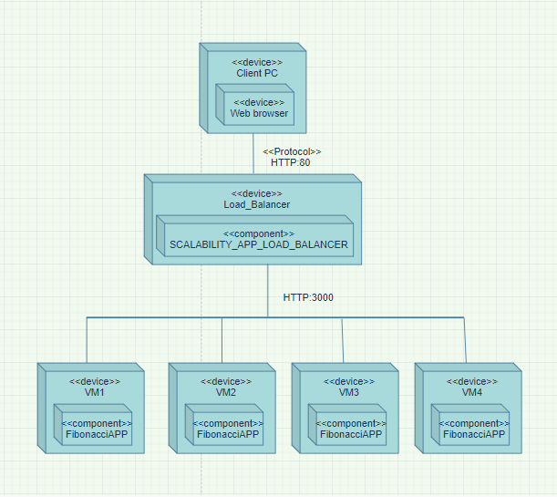